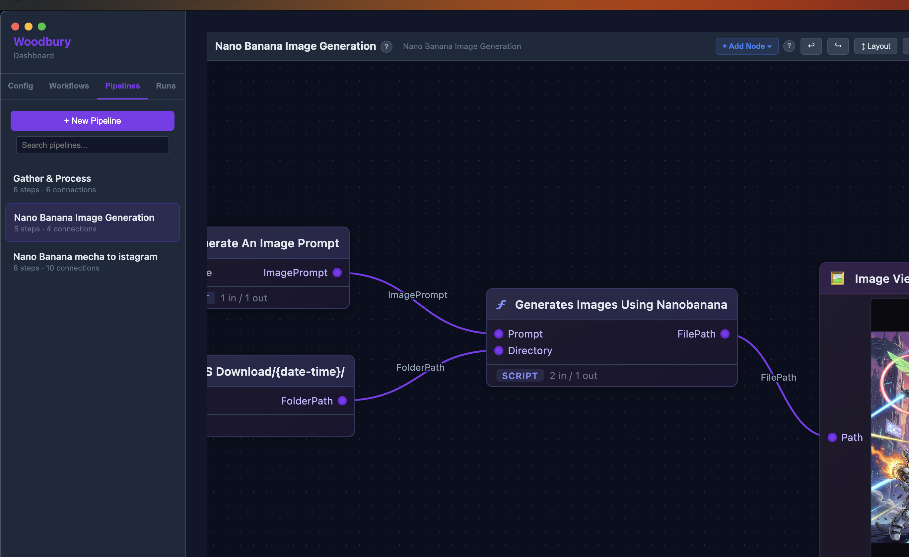

<p align="center">
  
</p>

<h1 align="center">Woodbury</h1>

<p align="center">
  <strong>Desktop automation, workflow replay, visual AI, and an embedded coding agent.</strong><br/>
  Woodbury is an Electron app and CLI for recording browser interactions, replaying them as workflows, composing multi-step pipelines, and running an agentic tool loop against your local workspace.
</p>

<p align="center">
  <a href="https://github.com/Zachary-Companies/woodbury/releases/latest"><strong>Releases</strong></a> · <a href="https://woobury-ai.web.app">Website</a> · <a href="docs/README.md">Docs Map</a>
</p>

---

## What This Repo Contains

This repository is the main Woodbury application. It includes:

- An Electron desktop app
- A Node.js/TypeScript CLI and REPL
- A dashboard server and browser-based dashboard UI
- A workflow recorder and executor for browser and desktop automation
- A visual pipeline/composition system
- A Node.js ONNX inference server for UI element matching
- An extension system and MCP integration surface
- Social scheduling and media workflow modules

The separate training repo for visual models lives at [woobury-models](https://github.com/Zachary-Companies/woobury-models). This repo runs ONNX inference at runtime; it does not contain the Python training pipeline itself.

## What Woodbury Does

Woodbury is a desktop automation platform centered around four connected pieces:

- Record browser actions through the Chrome extension and save them as workflow documents.
- Replay those workflows with selector fallback logic and visual verification.
- Build larger automations as graph-based compositions in the dashboard.
- Use the embedded AI assistant in the CLI or dashboard chat to inspect code, generate assets, and operate against the current workspace.

For the current status of the dashboard chat harness and v3 skills-first loop, see [docs/chat-skills-status.md](docs/chat-skills-status.md).



## Major Subsystems

- **Electron app**: desktop shell, tray/menu integration, auto-update plumbing, dashboard launcher
- **Dashboard**: local HTTP server plus browser UI for workflows, compositions, runs, extensions, training, chat, assets, schedules, and social features
- **Workflow engine**: recording, replay, variable substitution, validation, and execution snapshots
- **Visual AI**: ONNX Runtime plus Sharp-based preprocessing for element embedding and comparison
- **Agentic loop**: built-in tools plus dynamically loaded extension and MCP tools
- **Extension system**: local extensions can register tools, commands, system prompt guidance, and web UI

## Repository Layout

| Path | Purpose |
|------|---------|
| `src/` | Main TypeScript application code |
| `src/dashboard/` | Dashboard server and route handlers |
| `src/config-dashboard/` | Browser-side dashboard assets |
| `src/workflow/` | Workflow recording, replay, validation, and visual verification |
| `src/inference/` | Node.js ONNX inference server and image preprocessing |
| `src/loop/` | Embedded agent runtime and built-in tools |
| `electron/` | Electron main process and preload code |
| `chrome-extension/` | Browser extension used for recording and browser bridge behavior |
| `extensions/` | Bundled Woodbury extensions copied into builds |
| `apps/woodbury-web/` | Marketing site |
| `docs/` | Architecture, API, contracts, and runbooks |

## Requirements

- Node.js 22+
- npm
- At least one supported LLM provider key for AI features:
  - `ANTHROPIC_API_KEY`
  - `OPENAI_API_KEY`
  - `GROQ_API_KEY`

Visual model training is not required to run the app. Training is handled by the separate Python repo when needed.

## Getting Started From Source

Install dependencies and build:

```bash
npm install
npm run build
```

If you want the global CLI command:

```bash
npm link
```

There is also a convenience setup script that does the same sequence:

```bash
./setup.sh
```

Set provider credentials in your shell environment before using AI features:

```bash
export ANTHROPIC_API_KEY=your-key
export OPENAI_API_KEY=your-key
export GROQ_API_KEY=your-key
```

## Running Woodbury

Run the Electron desktop app in development:

```bash
npm run electron:dev
```

Restart the Electron dev app after changes:

```bash
npm run electron:restart-dev
```

Run the compiled CLI directly:

```bash
node dist/index.js --help
```

If you linked the package globally, use:

```bash
woodbury
woodbury "read package.json"
woodbury --safe "inspect this repo"
```

## Key Scripts

| Command | Purpose |
|---------|---------|
| `npm run build` | Compile TypeScript into `dist/` |
| `npm test` | Run Jest tests |
| `npm run lint` | Run ESLint over `src/` |
| `npm run electron:dev` | Build and launch the Electron app |
| `npm run electron:build` | Build the macOS Electron package |
| `npm run electron:build:win` | Build the Windows Electron package |
| `npm run deploy:web` | Build and deploy the marketing site |

## Workflow And Visual AI Overview

Woodbury workflows are stored as JSON documents and can combine browser automation, desktop input, variables, expectations, and retry behavior.

At runtime, visual verification uses the local inference module in `src/inference/`:

- Preprocess screenshots and crops with Sharp
- Run embeddings with `onnxruntime-node`
- Compare reference elements against current UI state
- Support region search and weighted ranking for element relocation

The runtime inference server matches the Python training pipeline's preprocessing contract. If you change preprocessing in the model repo, the Node.js inference path must stay in sync.

## Dashboard And Compositions

The dashboard is the operational center of the app. It serves a local UI for:

- Workflow recording and replay
- Pipeline/composition editing and execution
- Batch runs and schedules
- Extension and MCP management
- Training data preparation and model selection
- Chat sessions backed by the embedded agent loop
- Assets, storyboard, and social media tooling

The dashboard server lives in `src/dashboard/`. The browser assets it serves live in `src/config-dashboard/`.

## Extensions

Woodbury supports local extensions that can add:

- AI-callable tools
- Slash commands
- Additional system prompt guidance
- Dashboard web UI

See:

- [docs/extensions.md](docs/extensions.md)
- [docs/extension-api-reference.md](docs/extension-api-reference.md)
- [docs/extension-development.md](docs/extension-development.md)
- [docs/extension-testing.md](docs/extension-testing.md)

## Documentation

Start with the docs map:

- [docs/README.md](docs/README.md)

Useful entry points:

- [docs/architecture.md](docs/architecture.md)
- [docs/dashboard-api.md](docs/dashboard-api.md)
- [docs/chat-api-and-sse-contract.md](docs/chat-api-and-sse-contract.md)
- [docs/pipeline-lifecycle-contract.md](docs/pipeline-lifecycle-contract.md)
- [docs/composition-schema-and-validation.md](docs/composition-schema-and-validation.md)
- [docs/mcp-integration-guide.md](docs/mcp-integration-guide.md)

## License

MIT
